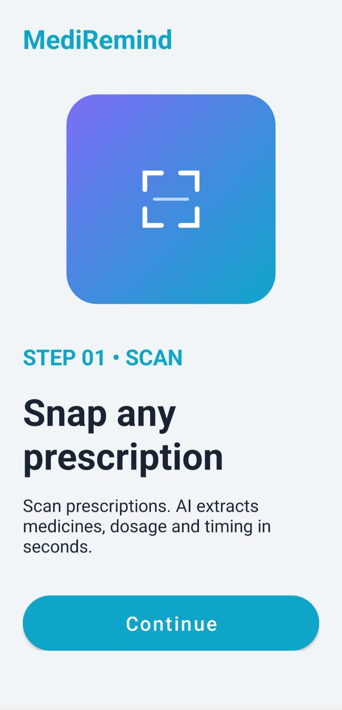
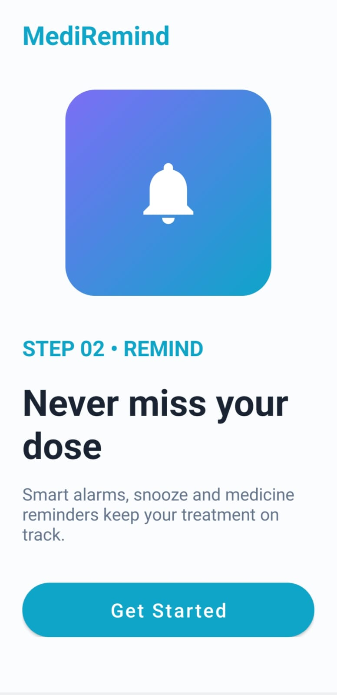
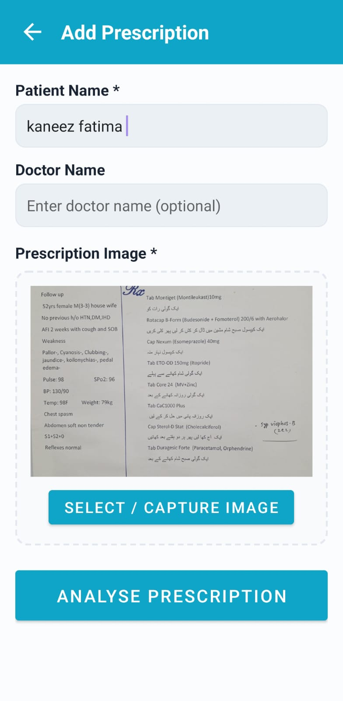
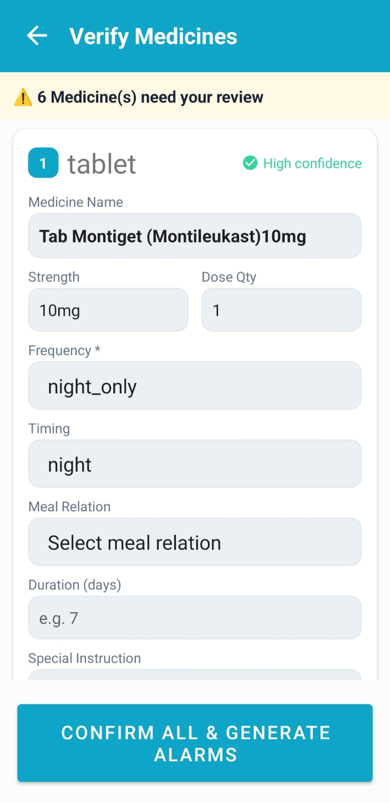

# Smart-Prescription-Scanner-and-Medication-Reminder-Mobile-Application
# MediRemind

Smart Prescription Scanner and Medicine Reminder Application for Better Medication Management.

## About the App

MediRemind is an Android healthcare application designed to help users manage prescriptions, medicines, and medication reminders efficiently. The app allows users to scan medical prescriptions(English & Urdu), extract medicine information using OCR and AI processing, and automatically generate medicine alarms. Users can also manually add medicines and customize reminder schedules. The application is especially useful for patients who take multiple medicines and want a simple way to avoid missing doses.

## App Screenshots

| Splash Screen                            | Onboarding Screens                        | Home                   |
| ---------------------------------------- | ------------------------------------ | ------------------------------------ |
|  | )   |  |

| Prescription Scan                          | Medicines                          | Alarms                                    |
| ---------------------------------------------- | --------------------------------------- | ---------------------------------------------- |
|  |  |  |

## Features

* Prescription scanning using camera or gallery
* OCR-based text extraction
* AI-powered medicine information parsing
* Medicine verification before saving
* Automatic alarm generation
* Manual medicine management
* Multiple alarm scheduling
* Upcoming alarm tracking
* Medicine repository management
* SQLite local database storage
* User-friendly Android interface

## Technologies Used

* Java
* Android Studio
* XML
* SQLite Database
* Android SDK
* RecyclerView
* AlarmManager
* Broadcast Receivers
* Material Design Components
* Gradle

## APK Download

Add APK link here.
[Download APK](apk/app-debug.apk)

## How to Install the APK

1. Download the APK file.
2. Open the APK file on an Android device.
3. Allow installation from unknown sources if prompted.
4. Install the application.
5. Launch MediRemind and start managing your medicines.

## How to Run the Project

1. Clone or download this repository.
2. Open the project in Android Studio.
3. Allow Gradle Sync to complete.
4. Connect an Android device or start an emulator.
5. Build and run the application.

## Privacy Policy

Add privacy policy file or link here.

Example:

[View Privacy Policy](docs/privacy_policy.pdf)

## Future Enhancements

* Drug interaction detection
* Caregiver notifications
* Cloud backup and synchronization
* Pill identification system
* Medication adherence analytics
* AI-generated health insights
* Doctor and pharmacy integration

## Developed By

Kaneez Fatima

BS Computer Science Student 6th Semester
